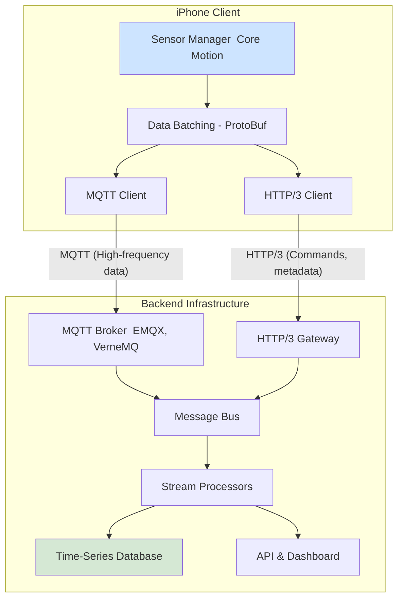

# biometric-backend-mqtt-http3
high throughput telemetry streaming via gRPC over HTTP/2 or HTTP/3

# Cross Project
- https://github.com/ObrienlabsDev/biometric-android-app/issues/8

# Requirements
The existing biometric event/telemetry stream https://github.com/ObrienlabsDev/biometric-backend is using old school http/1.1 via 1000 to 200 ms REST calls from iphone and android devices - storing to a relational database via JPA and providing an AJAX based front end for geolocation.  This repo will move this architecture into a high throughput real time sub 20 ms http/2 channel architecture so that I can get the full bandwidth of sensor data like the accelerometer and tesla MEMS.

# Constraints
## C1: Cellular Network Packet Loss Handling

# Use Cases

# Design Issues
## DI1: IOS Client
## DI2: Android Client
## DI3: MQTT Backend
see https://docs.emqx.com/en/emqx/latest/

# Architecture
## Diagrams

# Implementation

# Deployment

# Links
- Robin Marx's book is currently n/a - online only at https://http3-explained.haxx.se/
